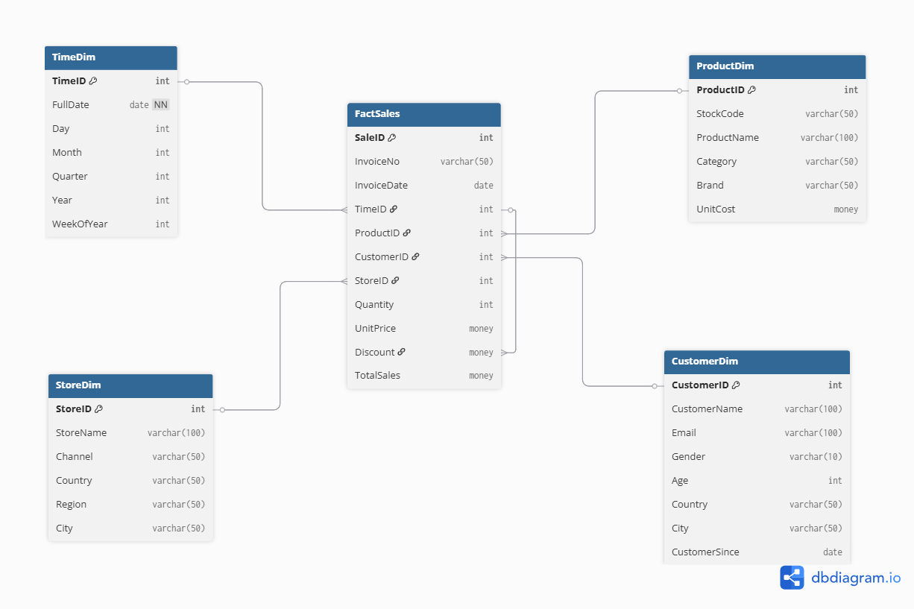

# DSA-2040_Practical_Exam_SnitTeshome552

## *Overview*
This repository contains my submission for the *DSA 2040 End Semester Practical Exam (2025)*. The exam covers *Data Warehousing* and *Data Mining* tasks. All code is implemented in Python, using libraries such as *pandas, numpy, scikit-learn, sqlite3*, and *matplotlib*. SQL queries are executed using *SQLite*.

---

## *Project Folder Structure*

```plaintext

DSA-2040_Practical_Exam_SnitTeshome552/
├── Section_1/
│   ├── Task_1_DataWarehouse_Design.sql
│   ├   ├── schema_diagram.png
│   ├   └── schema_design.sql
│   ├── Task_2_ETL_Process_Implementation/
│   │   ├── etl_retail.py
│   │   ├── retail_dw.db
│   │   └── synthetic_data/             ← CSVs if generated
│   └── Task_3_OLAP_Queries_and_Analysis/
│       ├── olap_queries.sql
│       ├── total_sales_by_Country.png
│       └── analysis_report.md
├── Section_2/
│   ├── preprocessing_iris.py
│   ├── clustering_iris.py
│   ├── mining_iris_basket.ipynb
│   ├── iris.ipynb
│   └── train_test/                     ← Train/test CSV splits
├── Visualization/
│   └── *.png                           ← Additional visualizations
└── README.md
                                  # This file
````
# *Section 1: Data Warehousing (50 Marks)*
## *Task 1: Data Warehouse Design (15 Marks)*


### *1.Design a star schema for this data warehouse.*
### *Star Schema Diagram:`Usingdbdiagram.io`*


## *2. Explain why you chose star schema over snowflake (2-3 sentences).*


A *Star Schema* is a data warehousing design where a central *fact table* containing measurable metrics (e.g., sales amount, quantity sold) is directly linked to multiple *dimension tables* containing descriptive attributes (e.g., product category, customer demographics, time period, store location). The schema visually resembles a star, with the fact table at the center and the dimensions radiating outward.

### *Why Star Schema is Used in This Assignment*

- **_Simplified Querying_**  
  - *Direct links between the fact table and dimension tables reduce query complexity.*  
  - *Eliminates multiple joins from normalization, making analytical queries (e.g., total sales per quarter by category) faster to write and interpret.*  

- **_Optimized for OLAP_**  
  - *Purpose-built for Online Analytical Processing tasks.*  
  - *Supports aggregation, filtering, drill-down, and slicing efficiently — matching the assignment’s sales, inventory, and demographic analysis needs.*  

- **_High Aggregation Performance_**  
  - *Small, denormalized dimension tables speed up joins with the fact table.*  
  - *Outperforms snowflake schemas that require multiple join operations for analysis.*  

- **_Ease of Maintenance & Scalability_**  
  - *New facts (e.g., returns, shipments) or expanded dimensions can be added without major redesign.*  
  - *Suitable for growing retail datasets with evolving requirements.*  

- **_Clear Business Representation_**  
  - *Dimensions directly map to real-world entities (Product, Customer, Time, Store).*  
  - *Both technical teams and business analysts can quickly understand and use the model.*  

----
### *3.Write SQL CREATE TABLE statements for the fact and dimension tables*

### *Full Schema Code Location*

The *complete schema creation scripts* (including all dimension tables) and the schema diagram are located in:

```
Section_1/
├── Task_1_DataWarehouse_Design.sql
    └── schema_design.sql
```

---

### *Dimension Tables Defined in the Folder*

*These dimension tables are fully defined inside the SQL scripts above:*

- *TimeDim* – Stores date-related attributes for temporal analysis.  
- *CustomerDim* – Stores customer details such as name, contact info, and demographics.  
- *ProductDim* – Stores product details including category, brand, and cost.  
- *StoreDim* – Stores store or sales channel details including location and region.  
### *Data Warehouse Schema – Fact Table Sample*
The *FactSales* table links to these dimensions for analytical queries such as roll-up, drill-down, and slicing.


```sql
CREATE TABLE FactSales (
    SaleID INT PRIMARY KEY IDENTITY(1,1),
    InvoiceNo NVARCHAR(50),
    InvoiceDate DATE,
    TimeID INT,
    ProductID INT,
    CustomerID INT,
    StoreID INT,
    Quantity INT,
    UnitPrice MONEY,
    Discount MONEY DEFAULT 0,
    TotalSales MONEY,
    FOREIGN KEY (TimeID) REFERENCES TimeDim(TimeID),
    FOREIGN KEY (ProductID) REFERENCES ProductDim(ProductID),
    FOREIGN KEY (CustomerID) REFERENCES CustomerDim(CustomerID),
    FOREIGN KEY (StoreID) REFERENCES StoreDim(StoreID)
);
```


---


## *Instructions to Run*

1. Clone the repository:

```bash
git clone https://github.com/<YourUsername>/DSA-2040_Practical_Exam_SnitTeshome552.git
cd DSA-2040_Practical_Exam_SnitTeshome552
````

2. For *Data Warehousing Tasks*:

   * Run the SQL scripts in SQLite or your preferred SQL client.
   * Execute `etl_retail.py` to load the CSV or generated data into `retail_dw.db`.
   * Visualizations are saved in `Visualization/` or as indicated in each task folder.

3. For *Data Mining Tasks*:

   * Run `preprocessing_iris.py` first to preprocess and split the Iris dataset.
   * Execute `clustering_iris.py` for clustering experiments and visualizations.
   * Execute `mining_iris_basket.ipynb` for Decision Tree classification, KNN comparison, and Association Rule Mining with Apriori.

4. Ensure required libraries are installed:

```bash
pip install pandas numpy matplotlib scikit-learn seaborn mlxtend
```

---

## *Notes*

* All synthetic data is reproducible using provided scripts.
* Analysis reports are included in Markdown or Notebook comments.
* Outputs (plots, tables) are saved in designated folders or embedded in notebooks.
* Any missing or partial outputs are included to demonstrate attempted work for partial credit.

---

## *Author*

*Snit Teshome*
*DSA 2040 – USIU-A 2025*


