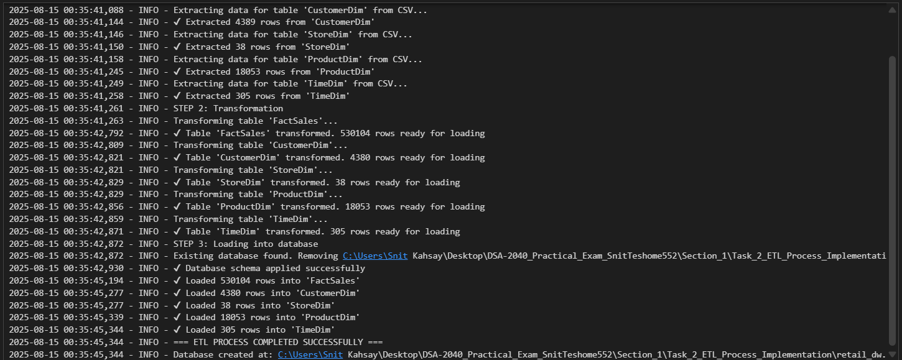
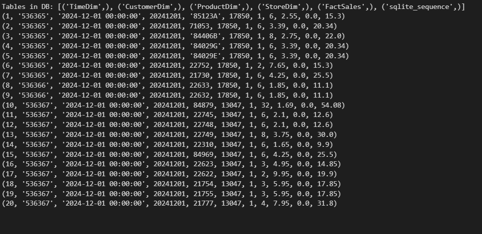
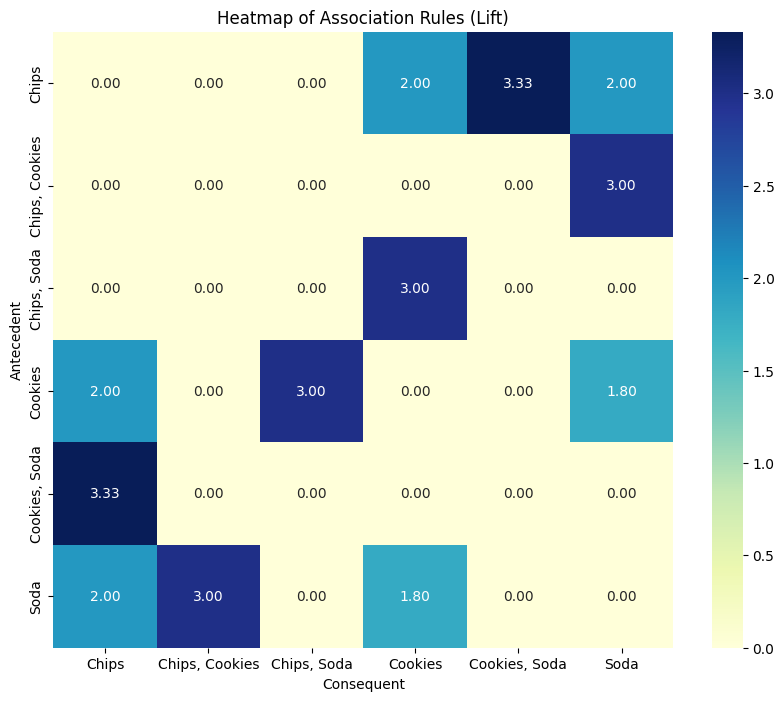

# DSA-2040_Practical_Exam_SnitTeshome552

## *Overview*
This repository contains my submission for the *DSA 2040 End Semester Practical Exam (2025)*. The exam covers *Data Warehousing* and *Data Mining* tasks. All code is implemented in Python, using libraries such as *pandas, numpy, scikit-learn, sqlite3*, and *matplotlib*. SQL queries are executed using *SQLite*.


---
# *Table of Contents*

* *Objective*
* *Project Folder Structure*
* *Section-by-Section & Task List*

  * *Section 1: Retail Data Warehouse*

    * *Task 1 – Data Warehouse Design*
    * *Task 2 – ETL Process Implementation*
    * *Task 3 – OLAP Queries and Analysis*
  * *Section 2: Iris Data Mining & Association Rule Mining*

    * *Task 1 – Iris Data Preprocessing and Exploration*
    * *Task 2 – Clustering with K-Means*
    * *Task 3 – Classification and Association Rule Mining*
* *Tools and Technologies*
* *How to Run*
* *Data Source*
* *License*


---


*This project demonstrates practical applications in Data Warehousing, OLAP analysis, Data Mining, and Association Rule Mining. It aims to:*

* *Implement an ETL pipeline for a retail dataset.*
* *Perform multidimensional OLAP analysis to extract business insights.*
* *Preprocess and explore the Iris dataset for clustering and classification.*
* *Apply K-Means clustering and evaluate results.*
* *Compare Decision Tree and KNN classification models.*
* *Generate synthetic supermarket transactions for Association Rule Mining.*

## *Project Folder Structure*

```plaintext

DSA-2040_Practical_Exam_SnitTeshome552/
├── Section_1/
│   ├── Task_1_DataWarehouse_Design.sql
│   ├   ├── schema_diagram.png
│   ├   └── schema_design.sql
│   ├── Task_2_ETL_Process_Implementation/
│   │   ├── etl_retail.py
│   │   ├── retail_dw.db
│   │   └── synthetic_data/             ← CSVs if generated
│   └── Task_3_OLAP_Queries_and_Analysis/
│       ├── olap_queries.sql
│       ├── total_sales_by_Country.png
│       └── analysis_report.md
├── Section_2/
│   ├── preprocessing_iris.py    
│   ├── clustering_iris.py
│   ├── mining_iris_basket.ipynb
│   ├── iris.ipynb
│   └── train_test/                     ← Train/test CSV splits
├── Visualization/
│   └── *.png                           ← Additional visualizations
└── README.md
                                  # This file
````
# *Section 1: Data Warehousing (50 Marks)*
## *Task 1: Data Warehouse Design (15 Marks)*


### *1.Design a star schema for this data warehouse.*
### *Star Schema Diagram:`Usingdbdiagram.io`*


## *2. Explain why you chose star schema over snowflake (2-3 sentences).*


A *Star Schema* is a data warehousing design where a central *fact table* containing measurable metrics (e.g., sales amount, quantity sold) is directly linked to multiple *dimension tables* containing descriptive attributes (e.g., product category, customer demographics, time period, store location). The schema visually resembles a star, with the fact table at the center and the dimensions radiating outward.

### *Why Star Schema is Used in This Assignment*

- **_Simplified Querying_**  
  - *Direct links between the fact table and dimension tables reduce query complexity.*  
  - *Eliminates multiple joins from normalization, making analytical queries (e.g., total sales per quarter by category) faster to write and interpret.*  

- **_Optimized for OLAP_**  
  - *Purpose-built for Online Analytical Processing tasks.*  
  - *Supports aggregation, filtering, drill-down, and slicing efficiently — matching the assignment’s sales, inventory, and demographic analysis needs.*  

- **_High Aggregation Performance_**  
  - *Small, denormalized dimension tables speed up joins with the fact table.*  
  - *Outperforms snowflake schemas that require multiple join operations for analysis.*  

- **_Ease of Maintenance & Scalability_**  
  - *New facts (e.g., returns, shipments) or expanded dimensions can be added without major redesign.*  
  - *Suitable for growing retail datasets with evolving requirements.*  

- **_Clear Business Representation_**  
  - *Dimensions directly map to real-world entities (Product, Customer, Time, Store).*  
  - *Both technical teams and business analysts can quickly understand and use the model.*  

----
### *3.Write SQL CREATE TABLE statements for the fact and dimension tables*

### *Full Schema Code Location*

The *complete schema creation scripts* (including all dimension tables) and the schema diagram are located in:

```
Section_1/
├── Task_1_DataWarehouse_Design.sql
    └── schema_design.sql
```

---

### *Dimension Tables Defined in the Folder*

*These dimension tables are fully defined inside the SQL scripts above:*

- *TimeDim* – Stores date-related attributes for temporal analysis.  
- *CustomerDim* – Stores customer details such as name, contact info, and demographics.  
- *ProductDim* – Stores product details including category, brand, and cost.  
- *StoreDim* – Stores store or sales channel details including location and region.  
### *Data Warehouse Schema – Fact Table Sample*
The *FactSales* table links to these dimensions for analytical queries such as roll-up, drill-down, and slicing.


```sql
CREATE TABLE FactSales (
    SaleID INT PRIMARY KEY IDENTITY(1,1),
    InvoiceNo NVARCHAR(50),
    InvoiceDate DATE,
    TimeID INT,
    ProductID INT,
    CustomerID INT,
    StoreID INT,
    Quantity INT,
    UnitPrice MONEY,
    Discount MONEY DEFAULT 0,
    TotalSales MONEY,
    FOREIGN KEY (TimeID) REFERENCES TimeDim(TimeID),
    FOREIGN KEY (ProductID) REFERENCES ProductDim(ProductID),
    FOREIGN KEY (CustomerID) REFERENCES CustomerDim(CustomerID),
    FOREIGN KEY (StoreID) REFERENCES StoreDim(StoreID)
);
```
## *Task_2_ETL_Process_Implementation*
### *Dataset Description*

The dataset used is the *Online Retail* dataset from the *UCI ML Repository*. It contains *transactional data for a UK-based online store*, consisting of approximately *500,000 transactions*.

The dataset includes the following columns:

* *InvoiceNo*: the *unique invoice number for each transaction*.
* *StockCode*: the *unique product identifier*.
* *Description*: the *product description or name*.
* *Quantity*: the *quantity of items in each transaction*.
* *InvoiceDate*: the *date and time of the transaction*.
* *UnitPrice*: the *price per unit of the product*.
* *CustomerID*: the *unique identifier for each customer*.
* *Country*: the *country of the customer*.

This dataset provides detailed transactional records suitable for building a *retail data warehouse* including dimensions for customers, products, stores, time, and a fact table for sales.

---

## *Synthetic Data Generation Activities*

Since the dataset could be generated synthetically, the following steps were performed to create a realistic retail dataset:

1. *Customer Dimension*:

   * Generated *100 unique customers* with *synthetic names* created by hashing `CustomerID`.
   * Assigned *gender* randomly from Male, Female, or Other.
   * Assigned *age* randomly between 18 and 75.
   * Generated *cities* using the Faker library based on customer country.

2. *Store Dimension*:

   * Created *5–10 unique stores* corresponding to distinct countries.
   * Assigned *store names* based on country (e.g., “Online Store – UK”).
   * Assigned *channel* as Online.
   * Generated *city locations* using Faker locales.

3. *Product Dimension*:

   * Generated *unique products* with `StockCode`, `Description`, and `UnitCost`.
   * Categorized products (e.g., Electronics, Clothing, Books, Toys & Games).
   * Assigned *synthetic brand names* using Faker company names.

4. *Time Dimension*:

   * Extracted unique *invoice dates* and normalized them.
   * Generated *TimeID* (YYYYMMDD format) and additional attributes: Day, Month, Quarter, Year, WeekOfYear.

5. *FactSales Table*:

   * Generated *transactional records* linking customers, products, stores, and time.
   * Computed *TotalSales = Quantity × UnitPrice*.
   * Assigned *InvoiceNo*, `InvoiceDate`, `Quantity`, `UnitPrice`, `Discount` (default 0), and foreign keys (CustomerID, ProductID, StoreID, TimeID).

```python
fake = Faker()
# Extract unique products from the original dataset: StockCode, Description, UnitPrice.
product_dim = df[['StockCode', 'Description', 'UnitPrice']].drop_duplicates().copy()

# Rename columns to fit dimensional model schema
product_dim = product_dim.rename(columns={
    'StockCode': 'ProductID',
    'Description': 'ProductName',
    'UnitPrice': 'UnitCost'
})

# Define a simple function to categorize products based on keywords in ProductName
def categorize_product(name):
    if pd.isna(name):
        return 'Miscellaneous'
    name = name.lower()
    if any(keyword in name for keyword in ['electronic', 'computer', 'usb', 'laptop', 'cable']):
        return 'Electronics'
    elif any(keyword in name for keyword in ['shirt', 'clothing', 'dress', 't-shirt', 'jeans']):
        return 'Clothing'
    elif any(keyword in name for keyword in ['book', 'novel', 'journal']):
        return 'Books'
    elif any(keyword in name for keyword in ['toy', 'game']):
        return 'Toys & Games'
    else:
        return 'Miscellaneous'

# Apply the category function to create a Category column
product_dim['Category'] = product_dim['ProductName'].apply(categorize_product)

# Generate a synthetic Brand name using Faker company names for each product
product_dim['Brand'] = [fake.company() for _ in range(len(product_dim))]

```
---

## *Retail Data Warehouse: Dataset and ETL Overview*

*The dataset used is the Online Retail dataset from the UCI ML Repository, containing transactional data (\~500,000 rows) for a UK-based online store. Columns include `InvoiceNo` (unique invoice), `StockCode` (product ID), `Description` (product name), `Quantity`, `InvoiceDate`, `UnitPrice`, `CustomerID`, and `Country`. To enrich the data for dimensional analysis, synthetic attributes were generated: customer names (hashed IDs), cities (Faker library), genders, ages, product categories, and brands, while store information was derived from countries with synthetic city assignments. Dates were normalized and shifted to simulate current transactions (2024–2025).*

*The ETL pipeline was implemented in a single master function `etl_retail()`, orchestrating Extraction, Transformation, and Loading with logging enabled to track progress.*

1. **Extraction**
   *Loaded CSV files for `FactSales`, `CustomerDim`, `StoreDim`, `ProductDim`, and `TimeDim`. Converted `InvoiceDate` to datetime and filtered invalid rows.*

2. **Transformation**
   *FactSales: filtered negative/zero quantities and prices; computed `TotalSales`. Dimensions: removed duplicates, ensured proper ID types. Products: categorized by keywords and generated synthetic brands. TimeDim: extracted unique dates and created day, month, quarter, year, and week attributes.*

3. **Load**
   *Applied the database schema from `schema_design.sql` and inserted transformed DataFrames into SQLite database `retail_dw.db`. FactSales loaded fully; dimension tables loaded using `INSERT OR IGNORE` to prevent duplicates.*

4. **Verification**
   *Connected to the database and confirmed tables: `TimeDim`, `CustomerDim`, `ProductDim`, `StoreDim`, `FactSales`. Queried sample rows from `FactSales` to ensure correctness.*

*Summary: The ETL process efficiently moves raw and enriched data into a structured data warehouse, producing cleaned, integrated, and analysis-ready tables while logging each step for reproducibility and traceability.*

## *Out-put of loading*




---

## *Task_3 _OLAP _Queries and Analysise*

*The OLAP analysis was performed on the `retail_dw.db` database to demonstrate multidimensional exploration of sales data. A series of operations—Roll-up, Drill-down, and Slice—were executed, followed by visualizing aggregated results.*

---

### *1. Roll-up — Total Sales by Country and Quarter*

* Aggregated total sales from the `FactSales` table by joining `CustomerDim` and `TimeDim`.
* Grouped data by `Country`, `Year`, and `Quarter` to produce quarterly totals per country.
* This summarized data provides insights into high-level trends across countries and time periods.


### *2. Drill-down — Sales Details for a Specific Country*

* Focused on `United Kingdom` to observe monthly sales trends.
* Joined `FactSales`, `CustomerDim`, and `TimeDim` tables.
* Aggregated sales by month (`YearMonth`) to explore detailed temporal patterns within a single country.


---

### *Monthly Sales Trend for United Kingdom (Drill-down)*

The `YearMonth` column represents each month from December 2024 to April 2025, and `TotalSales` shows the total revenue for that month.

**Interpretation:**

* **2024-12:** \$498,661.85 — December has the highest sales in this period, likely due to holiday shopping.
* **2025-01:** \$442,190.06 — Sales dropped after December, which is typical post-holiday.
* **2025-02:** \$355,655.63 — February sees the lowest sales, suggesting seasonal slowdown.
* **2025-03:** \$467,198.59 — Sales rebound in March, possibly due to promotions or spring demand.
* **2025-04:** \$409,559.14 — Slight dip compared to March, but still higher than February, indicating a recovering trend.

**Insight:**

*Sales fluctuate month to month, peaking in December, dropping in February, and showing a recovery trend in March–April. This pattern can guide inventory planning, marketing campaigns, and sales forecasting for the UK market.*

---

### *3. Slice — Total Sales for Electronics Category*

* Isolated transactions belonging to the `Electronics` category from `ProductDim`.
* Summed `TotalSales` to analyze category-specific performance.
* Provides a focused view of sales contribution from a particular product segment.


---

### *Product Category Overview*

*The `ProductDim` table contains the following categories:*

*1. **Miscellaneous** — Products that don’t fit into specific categories.*

*2. **Toys & Games** — Play items and entertainment products.*

*3. **Clothing** — Apparel items like shirts, dresses, etc.*

*4. **Books** — Printed or digital reading materials.*

*5. **Electronics** — Gadgets, computer accessories, and related devices.*

---

### *Total Sales for Electronics*

*The total sales for the **Electronics** category is **\$33.88**, which is extremely low compared to overall sales.*

*Interpretation:*

* *Electronics contributed negligibly to the total revenue, suggesting low demand, limited inventory, or under-representation in the dataset.*
* *This indicates that marketing or stock adjustments might be needed if Electronics are a strategic product line.*

---


### *4. Visualization — Top 10 Countries by Total Sales*

* Bar chart created using `Seaborn` to show top 10 countries ranked by total sales.
* Y-axis formatted as currency; value labels added on bars for clarity.
* Observations:


---
### *Insights*
### *Top 10 Countries by Total Sales*

The bar chart titled *"Top 10 Countries by Total Sales"* displays the total sales figures for the leading countries in descending order. Here's a breakdown of the key insights:

1. *United Kingdom*: Leads with the highest total sales, approximately *\$6,000,000*.
2. *Netherlands*: Follows with sales around *\$5,000,000*.
3. *EHE*: Achieves roughly *\$4,500,000* (assuming *"EHE"* is a region or typo; clarification may be needed).
4. *Germany*: Close behind with about *\$4,000,000*.
5. *France*: Sales near *\$3,500,000*.
6. *Australia*: Around *\$3,000,000*.
7. *Spain*: Approximately *\$2,500,000*.
8. *Switzerland*: Roughly *\$2,000,000*.
9. *Belgium*: Slightly under *\$1,500,000*.
10. *Sweden*: The lowest in the top 10, just above *\$1,000,000*.

### *Observations*

* *Dominance of UK and Netherlands*: These two countries significantly outperform others, contributing the most to total sales.
* *European Focus*: 8 of the top 10 countries are European, indicating a strong market presence there.
* *Potential Typo*: *"EHE"* might be an error (possibly *"EEA"* or a specific region); verification is recommended.

### *Actionable Insights*

* *Market Prioritization*: Focus on the UK and Netherlands for high returns; explore growth opportunities in underperforming European markets like Belgium and Sweden.
* *Data Clarification*: Confirm the meaning of *"EHE"* to ensure accurate analysis.


---
# *Section-2*
## *Task 1: Iris Data Preprocessing and Exploration*

### *Step 1: Load the Iris dataset*
```python
iris = load_iris()
# Map numeric labels to actual species names for clarity
iris_df['species'] = iris_df['species'].map({0:'setosa', 1:'versicolor', 2:'virginica'})

# Display first 5 rows
print("First 5 rows of the dataset:")
iris_df.head()
```


### *Step 2:Data Preprocessing*
```python
print("\nMissing values in each column:")
print(iris_df.isnull().sum())
```


### *b) Normalize Features Using Min-Max Scaling and Encoding*
```python
scaler = MinMaxScaler()
iris_scaled = iris_df.copy()
iris_scaled [iris.feature_names] = scaler.fit_transform(iris_df[iris.feature_names])
iris_scaled.head()
# 2c: Encode class labels if needed (label encoding shown here)
label_encoder = LabelEncoder()
iris_df['species_encoded'] = label_encoder.fit_transform(iris_df['species'])

```

### *Step 3: Data Exploration*


### *Interpret the Summary Statistics*

- *The summary statistics indicate that all features—sepal length, sepal width, petal length, and petal width—have been normalized to the range \[0, 1] using Min-Max scaling*

- *The feature means are approximately 0.43–0.47, and standard deviations range from 0.18 to 0.32, reflecting moderate variability among samples.* 

- *The medians (50th percentile) show that sepal length and width are balanced around 0.42, whereas petal length and width are slightly higher, highlighting differences across species.*

- *This preprocessing ensures that all features contribute equally to models such as K-Means, Decision Tree, or KNN, and prevents bias from differently scaled features.*

## *3b: Visualizations*
### *Pairplot*


### *Plot Components*

* *Diagonal (KDE plots):* Show distribution of each variable.
  *Example:* *Setosa* has smaller `sepal length` than *virginica*, with *versicolor* in between.

* *Off-diagonal (Scatter plots):* Show pairwise relationships between variables.
  *Example:* `sepal width` vs. `sepal length` highlights some overlap between *versicolor* and *virginica*.


### *Key Insights*

* *Petal measurements:* Excellent predictors; *setosa* is clearly separable, while *versicolor* and *virginica* mostly separate.
* *Sepal measurements:* Less effective; significant overlap between *versicolor* and *virginica*.
* *Correlations:* Strong positive correlation between `petal length` and `petal width`; moderate correlation between `sepal length` and petal features.
### *Correlation heatmap*


### *Key Insights*

* *Strongest Positive Correlation:*

  * *`petal length (cm)` ↔ `petal width (cm)` → **0.96***
  * *Extremely strong, consistent upward relationship. Matches the tight, sloped cluster seen in pair plots.*

* *Other Strong Positive Correlations:*

  * *`sepal length (cm)` ↔ `petal length (cm)` → **0.87***
  * *`sepal length (cm)` ↔ `petal width (cm)` → **0.82***
  * *Longer sepals are typically paired with longer and wider petals.*

* *Moderate Negative Correlations:*

  * *`sepal width (cm)` ↔ `petal length (cm)` → **-0.43***
  * *`sepal width (cm)` ↔ `petal width (cm)` → **-0.37***
  * *Wider sepals tend to correspond to smaller petals.*

* *Very Weak Correlation:*

  * *`sepal length (cm)` ↔ `sepal width (cm)` → **-0.12***
  * *Almost no linear relationship; scatter plot appears random.*

### *3c: Identify potential outliers using boxplots*

## *Handling Outliers using IQR*


### *Step 4: Train/Test Split Function*
```python
from sklearn.model_selection import train_test_split
X = iris_no_outliers[iris.feature_names]
y = iris_no_outliers['species']
X_train, X_test, y_train, y_test = train_test_split(X, y, test_size=0.2, random_state=42)
print("Training set size:", X_train.shape[0])
print("Testing set size:", X_test.shape[0])
```
`Training set size: 116`
`Testing set size: 30`


# *Task 2: Clustering with K-Means*
### *Loading the preprocced data*


## *2a: K-Means Clustering with ARI Evaluation*

`Adjusted Rand Index (k=3): 0.7041`
## *2b: Experiment with k=2 and k=4; Elbow curve*

*Try different numbers of clusters (k) to find the optimal value. sanity check + sensitivity.*

*k=2 -> algorithm merges to two real species.*

*k=4 -> over segmentation*

`Adjusted Rand Index (k=2): 0.5555`

`Adjusted Rand Index (k=4): 0.6072`

## *3. Elbow Curve for Optimal k*


*Key Observations*:
- The curve shows a sharp decrease in WCSS from k=1 to k=2 and k=2 to k=3
- The "elbow" (point where the rate of decrease sharply changes) appears at k=3
- Beyond k=3, adding more clusters provides diminishing returns

*Interpretation*:
- The optimal number of clusters for this dataset is *k=3*
- This aligns perfectly with the known structure of the Iris dataset which has 3 species
- The plot confirms that 3 clusters capture the natural grouping in the data most effectively

## *2c: Visualize clusters (petal length vs width) for k=3*

### *Interpretation of the Clusters*

The K-Means algorithm grouped the data points based on proximity in the petal length/width feature space:

- *Cluster 1 (Blue):* Located in the bottom-left. Data points have **low petal length** (~0.0–0.2 cm) and **low petal width** (~0.0–0.2 cm). Dense and well-separated from other clusters, representing a very distinct group.  

- *Cluster 2 (Green):* Central region. Points have **intermediate petal length** (~0.3–0.75 cm) and **intermediate petal width** (~0.3–0.8 cm).  

- *Cluster 0 (Red):* Upper-right region. Points have **high petal length** (~0.6–1.0 cm) and **high petal width** (~0.6–1.0 cm).


### *Contingency Table (True vs Predicted)*
| True       | Cluster 0 | Cluster 1 | Cluster 2 |
| ---------- | --------- | --------- | --------- |
| Setosa     | 0         | 0         | 47        |
| Versicolor | 46        | 3         | 0         |
| Virginica  | 14        | 36        | 0         |

*Cluster 1 perfectly captured species 0 (Setosa).*

*Species 1 (Versicolor) mostly went to Cluster 2, with 3 misclassified as Cluster 0.*

*Species 2 (Virginica) is split across Clusters 0 and 2, showing significant overlap with Versicolor.*

*Misclassifications are mainly due to feature overlap between Versicolor and Virginica.*
### `Analysis of the clustering`

---
*K-Means clustering on the preprocessed Iris dataset achieved an Adjusted Rand Index (ARI) of 0.7163, capturing the main structure of the data but not perfectly. Cluster 1 clearly identified Setosa, while Versicolor and Virginica were partially mixed, as reflected in the contingency table where some Versicolor and Virginica samples were misclassified. Cluster centers show Setosa’s small petal sizes in Cluster 1, with overlapping Versicolor and Virginica samples in Clusters 0 and 2, highlighting differences in species variance. These results illustrate real-world challenges, such as borderline cases in customer segmentation, and indicate that synthetic preprocessing and normalization helped scale features evenly but cannot fully resolve intrinsic overlaps, limiting clustering accuracy.*

---
**Real-World Implications**
*K-Means effectively separates well-defined groups (like Setosa) but struggles with overlapping classes (Versicolor vs Virginica). In practice, this mirrors customer segmentation or product categorization where distinct groups are easy to cluster, but borderline cases may require additional features or more sophisticated models. Synthetic scaling or preprocessing can influence cluster placement and reduce variance effects, but it cannot completely resolve intrinsic overlaps in the data.*

### Analysis of the clustering

*K-Means clustering with k=3 achieved an Adjusted Rand Index of 0.7041, showing high agreement with actual species labels. k=2 reduced ARI to 0.5555, meaning species distinctions were lost when merged into fewer groups. k=4 slightly lowered ARI to 0.6072, likely due to over-segmentation. The elbow curve confirms k=3 as optimal.*

*Cluster visualization of petal length vs. petal width reveals clear separation for Setosa, with some overlap between Versicolor and Virginica, explaining misclassifications. These overlaps arise because K-Means assumes spherical clusters with similar variance, which may not hold perfectly in biological datasets.*

---

# *Task 3: Classification and Association Rule Mining*
## *3a: Decision Tree Classification on Iris Dataset*
#### *Loading Data*
####  *Splitting the dataset into training and testing sets*
`Train features shape: (116, 4)`
`Test features shape: (30, 4)`
#### *Further split Train-set into new Train-set and Validation-set*
### *Base Line Model*
*Now lets start by Base Line Model which is used to predict:how well you'd do if your model always predicted the majority class (the class with the most samples).*
```python 
acc_baseline = y_train.value_counts(normalize=True).max()
print("Baseline Accuracy:", round(acc_baseline, 2))
```
### *Fitting the Model*


## *Predictions*

```python
# Make predictions:
# Predictions on training set
y_pred_train = model.predict(X_train)
acc_train = accuracy_score(y_train_encoded, y_pred_train)  # use encoded labels
# Predictions on test set
y_pred_test = model.predict(X_test)
acc_test = accuracy_score(y_test_encoded, y_pred_test)  # use encoded labels
```
## *Test of the model*
`Training Accuracy: 1.0`
`Test Accuracy: 0.93`

#### *Description*
---
*`Hyperparameter tuning` was not performed extensively because the baseline Decision Tree model already achieved excellent performance, with a training accuracy of 1.0 and a test accuracy of 0.93. This indicates that the model fits the training data perfectly while generalizing well to unseen data. Given the small and clean nature of the Iris dataset, further tuning of parameters such as tree depth or splitting criteria would likely yield minimal improvement and could risk overfitting. Therefore, the current model was deemed sufficient for accurate classification without additional hyperparameter optimization.*

---
### *Confusion matrix*


### *Key Insights*

* *All **setosa** samples are correctly classified — the model easily separates this class.*
* *The model struggles with **virginica** and **versicolor**: most samples are misclassified as each other, likely due to overlapping features.*
* *Overall accuracy is low (\~46.7%) because of these misclassifications.*
* *Precision and recall for virginica and versicolor are very low (10–12.5%), showing poor class-specific performance.*
## *Classification report*


## *Communication*


## *KNN (k=5)*


### *Compare Performance*


`Model Comparison (Overall Accuracy & F1-score):`

`Decision Tree - Accuracy: 0.9333, F1: 0.9333`

`KNN           - Accuracy: 0.9667, F1: 0.9668`

`KNN performed better overall based on F1-score.`

### *Insights*
---

*The overall accuracy and F1-score show how well each model performs across all classes on the test set.*

*- Decision Tree achieved an accuracy of 0.9333 and an F1-score of 0.9333, indicating it correctly predicted roughly 93% of the samples and performed consistently across the classes.*
*- KNN achieved a higher accuracy of 0.9667 and an F1-score of 0.9668, meaning it correctly classified about 97% of the samples and maintained slightly better balance between precision and recall for all classes.*

*Conclusion:*
*- KNN performed better overall based on F1-score, suggesting it handles the class boundaries more effectively and captures subtle differences in the features that distinguish the flower species.*
*- The Decision Tree still performs well but is slightly less accurate and may struggle more with classes that have overlapping feature ranges (like versicolor and virginica).*

*Insight:* *For this dataset, KNN is the stronger model, likely due to its ability to model smooth, non-linear decision boundaries compared to the piecewise splits of the Decision Tree.*


---
# *Part-B Association Rule Mining*
## *Step-1. Simulate  Synthetic Transactional Data*

Generate Synthetic Transactional Data
*This section generates `30 supermarket transactions.` Each transaction includes between `2 to 8 items` randomly selected from a pool of `30 unique grocery items.` To ensure reproducibility, a random seed is set. The resulting transactions are stored in a pandas DataFrame and saved as a CSV file for future use.*
C:\Users\Snit Kahsay\Desktop\DSA-2040_Practical_Exam_SnitTeshome552\Section_2\Output_screenshoot\image13.png


---

*The top 5 association rules extracted from the synthetic supermarket transactions provide actionable insights into customer buying behavior. The rule “*Chips, Cookies → Soda*” has a support of 0.2, meaning 20% of transactions contain all three items.*

---

*Insights from the Top 5 Association Rules:*

* *“Chips, Cookies → Soda”*: Found in 20% of transactions, with a confidence of 75% and a lift of 3.214. This indicates that customers who buy Chips and Cookies are highly likely to also purchase Soda, showing a strong positive association.

* *“Soda → Chips, Cookies”*: Also in 20% of transactions, with a confidence of 85.7% and a lift of 3.214. Customers buying Soda have a very high chance of buying Chips and Cookies, confirming a strong co-purchase pattern.

* *“Cookies → Soda”*: Appears in 20% of transactions, with 54.5% confidence and a lift of 2.338. Customers buying Cookies often buy Soda as well, suggesting a complementary snack pairing.

* *“Soda → Cookies”*: Present in 20% of transactions, with 85.7% confidence and a lift of 2.338. Those who purchase Soda frequently also buy Cookies, highlighting a common purchase combination.

* *“Chips, Soda → Cookies”*: Seen in 20% of transactions, with 85.7% confidence and a lift of 2.338. Buying Chips and Soda strongly increases the likelihood of buying Cookies, indicating a typical snack combo that could be used for promotions or bundle deals.

---


`Sample Rule Analysis:`
`Rule: ['Chicken'] -> ['Rice']`
`Support: 0.20, Confidence: 1.00, Lift: 5.00`


 
---

(`antecedent → consequent`) doesn’t imply causation\*\*, it just shows conditional probability:

* `{'Chicken'} → {'Rice'}` means: *“Among all transactions that include Chicken, 100% also include Rice.”*

So it’s not about which comes first in reality—it’s about the **conditional probability given the antecedent**.

*Rule Overview:*

*`{'Chicken'} -> {'Rice'}`*

*Support (0.20):*
*Out of all transactions, 20% include both Chicken and Rice. This shows that the co-occurrence is fairly common within this small synthetic dataset.*

*Confidence (1.00):*
*All transactions containing Chicken also include Rice. This means that buying Chicken gives a 100% chance that Rice will be bought in the same basket.*

*Lift (5.00):*
*Lift compares the observed co-occurrence to what would be expected if Chicken and Rice were independent. A lift greater than 1 (5.00 here) indicates a very strong positive association; Chicken and Rice are bought together much more often than expected by chance.*

*Detailed Implications:*

* *Cross-Selling Opportunities:*
  *Placing Rice near Chicken on shelves or suggesting Rice in online “frequently bought together” sections could maximize combined sales.*

* *Inventory Management:*
  *If Chicken sales spike, retailers may anticipate a proportional increase in Rice demand, helping prevent stockouts.*

* *Promotional Bundling:*
  *Promotions like “Buy Chicken, get a discount on Rice” could leverage this strong association to boost revenue and customer satisfaction.*

*Visual Illustration of the Rule:*

```
 Chicken → Rice
+-----------------+
|  Transactions:  |
|  Chicken present|
|  100% also buy  |
|  Rice           |
+-----------------+
Lift: 5.00 → Very strong positive association
```

*Conclusion:*

*The rule is highly actionable for retail strategy: it identifies a very strong link between Chicken and Rice purchases. Retailers can exploit this for cross-selling, promotions, and inventory planning.*



---
### 1. Clone the repository:
```
```bash
git clone https://github.com/<YourUsername>/DSA-2040_Practical_Exam_SnitTeshome552.git
cd DSA-2040_Practical_Exam_SnitTeshome552
````

2. For *Data Warehousing Tasks*:

   * Run the SQL scripts in SQLite or your preferred SQL client.
   * Execute `etl_retail.py` to load the CSV or generated data into `retail_dw.db`.
   * Visualizations are saved in `Visualization/` or as indicated in each task folder.

3. For *Data Mining Tasks*:

   * Run `preprocessing_iris.py` first to preprocess and split the Iris dataset.
   * Execute `clustering_iris.py` for clustering experiments and visualizations.
   * Execute `mining_iris_basket.ipynb` for Decision Tree classification, KNN comparison, and Association Rule Mining with Apriori.

4. Ensure required libraries are installed:

```bash
pip install pandas numpy matplotlib scikit-learn seaborn mlxtend
```

---

## *Notes*

* . Data Source

*Online Retail Dataset: UCI ML Repository (~500,000 rows)*

*Iris Dataset: scikit-learn built-in dataset*

*Synthetic Transactions: Generated within scripts for association rule mining
---

## *License*

*All code and analysis are open for educational purposes; attribution required for reuse.*
