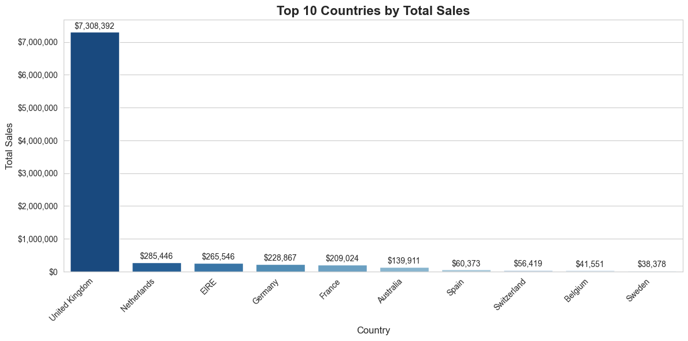

## *Task 3: OLAP Analysis*

The OLAP analysis on the *`retail_dw.db`* database explored sales data through **roll-up, drill-down, and slice operations**, complemented by visualizations to derive actionable insights.

### **1. Roll-up — Total Sales by Country and Quarter**

Aggregating sales from *`FactSales`* by *`Country`*, *`Year`*, and *`Quarter`* reveals that the *United Kingdom* leads in total sales, followed by *Netherlands*, *Germany*, and *France*. The top ten countries collectively dominate revenue, highlighting a concentrated market focus in Europe.

### **2. Drill-down — Monthly Sales for the United Kingdom**

Examining monthly sales from December 2024 to April 2025 shows fluctuations from approximately \$355,655 in February to \$498,661 in December, reflecting seasonal trends. This information provides guidance for inventory planning, promotional campaigns, and sales forecasting in the UK market.

### **3. Slice — Electronics Category Sales**

The total sales for the *Electronics* category amount to only \$33.88, indicating negligible contribution to overall revenue. This suggests limited demand or under-representation in the dataset, while higher-performing product lines such as *Clothing* or *Miscellaneous* likely drive the bulk of revenue. These insights inform marketing and stock allocation strategies for profitable categories.

### **4. Visualization — Top 10 Countries by Total Sales**

A bar chart of the top ten countries confirms that revenue is heavily concentrated in a few key markets, with the United Kingdom and Netherlands outperforming others. Lower-performing markets such as Belgium and Sweden represent potential opportunities for growth. Anomalies such as *EHE* should be clarified to ensure accurate analysis.

----

### **Summary and Insights**

The OLAP operations effectively demonstrate multi-level aggregation and detailed examination of sales data, supporting strategic decision-making. Key takeaways include:

* Focus on high-performing regions (UK and Netherlands) for targeted marketing and inventory planning.
* Optimize stock and promotional efforts for product lines driving the most revenue.
* Monitor underperforming markets for potential expansion opportunities.
* Synthetic data provides a realistic framework for analysis but may not fully capture real-world dynamics.

Overall, this analysis highlights the value of OLAP queries in guiding regional strategies, product management, and revenue optimization.

---
